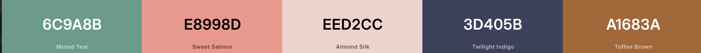
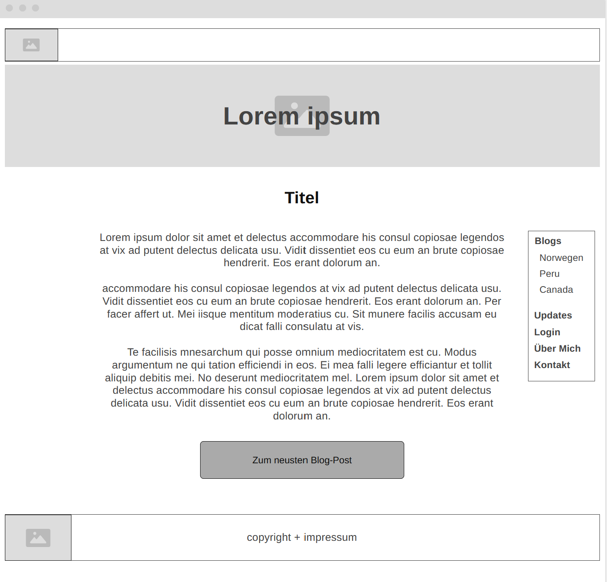
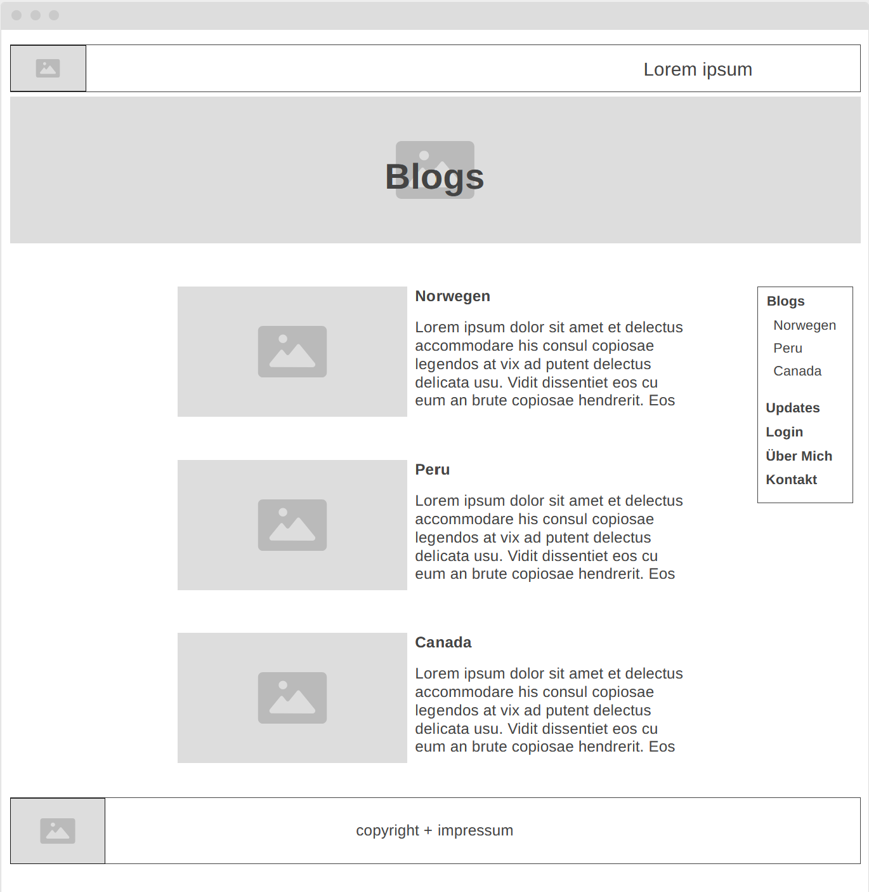
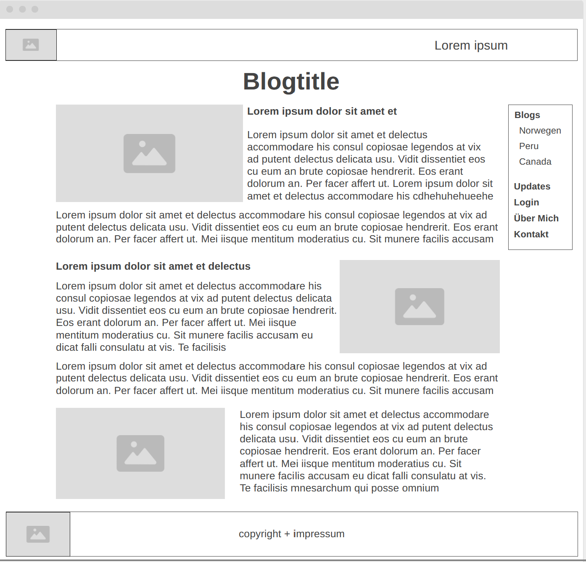
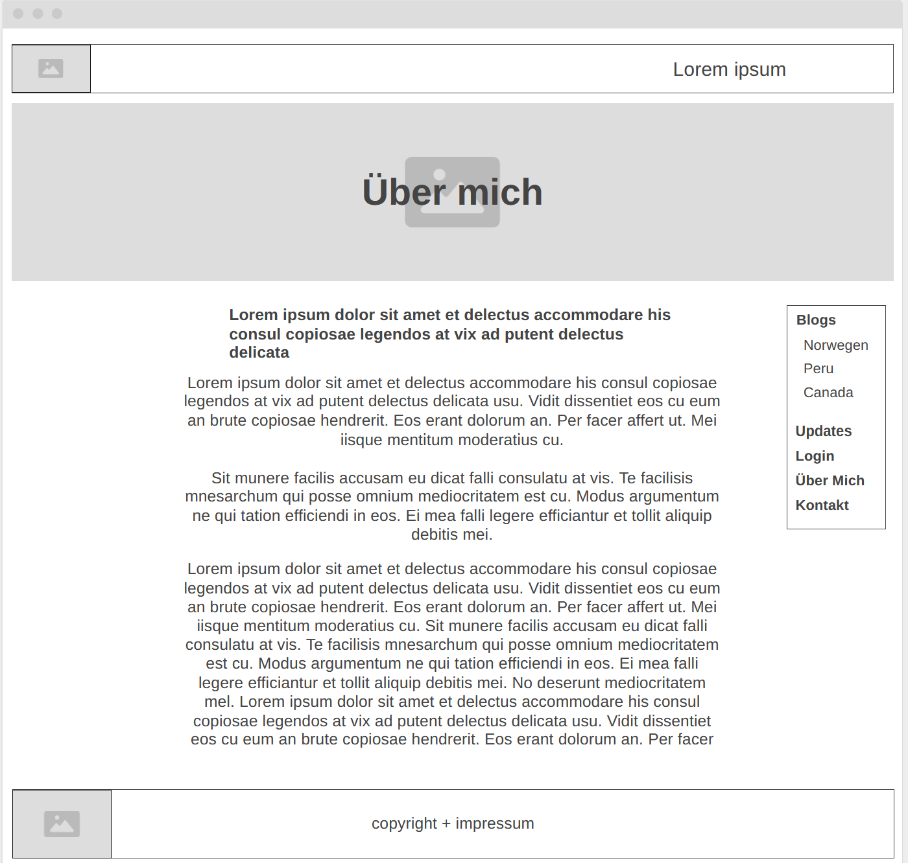
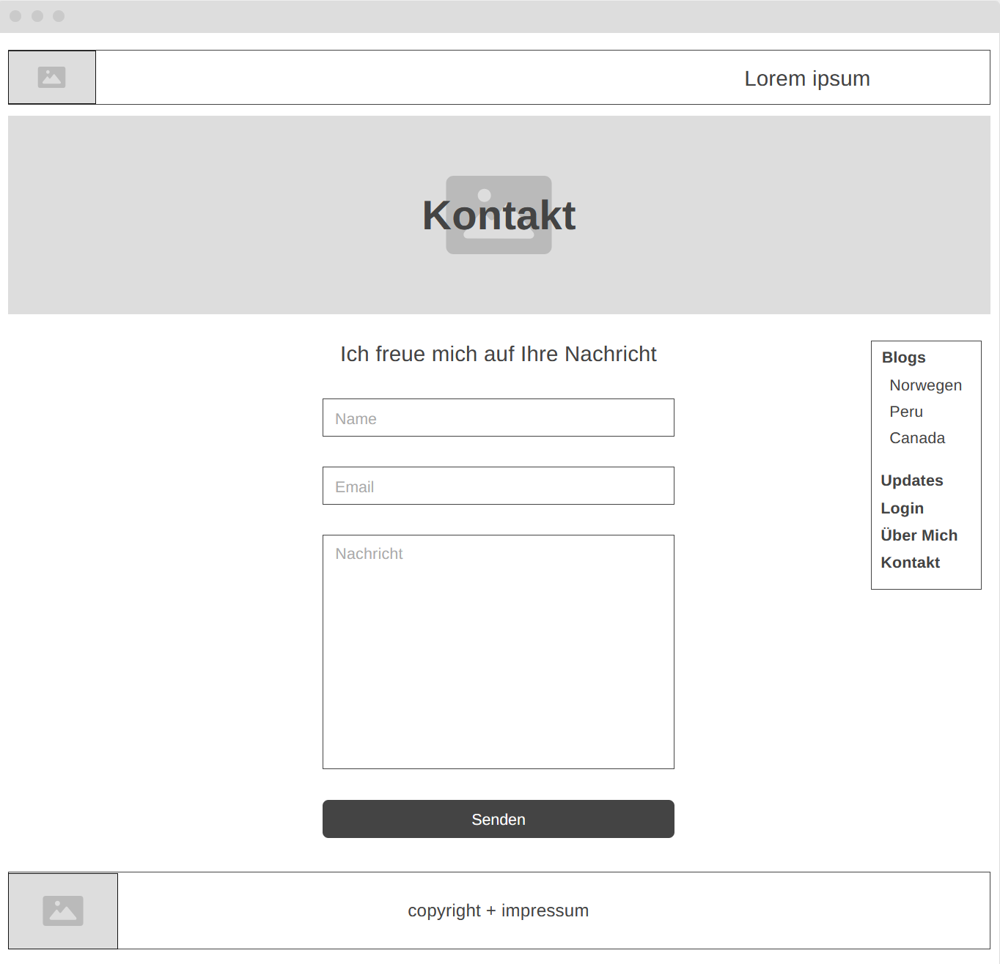
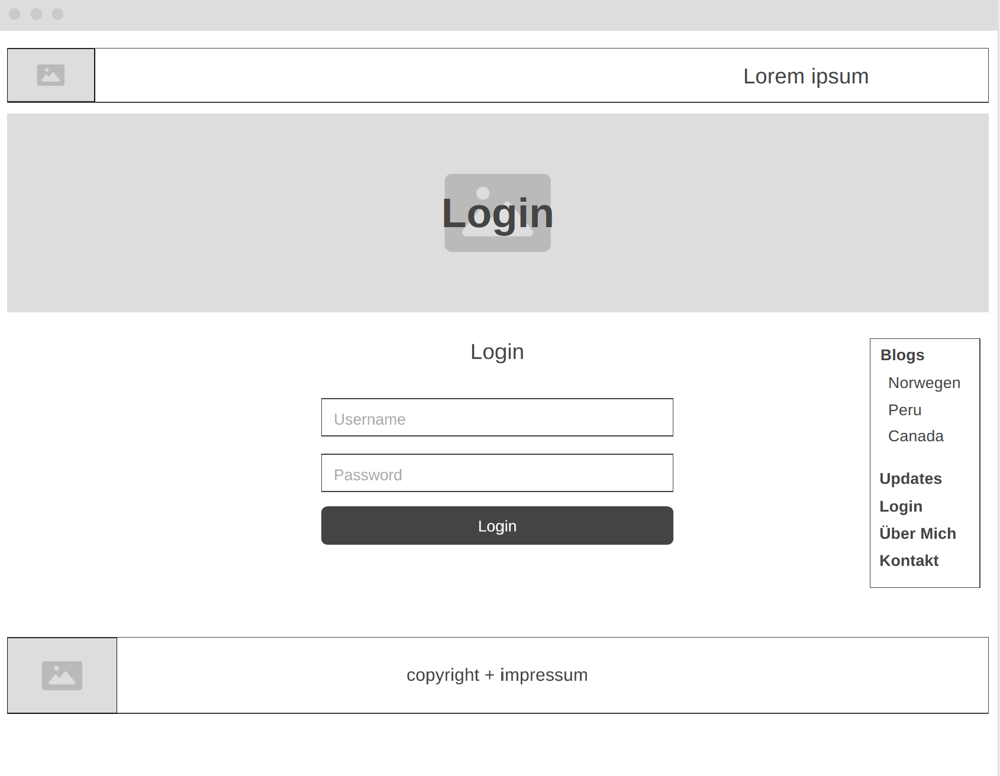
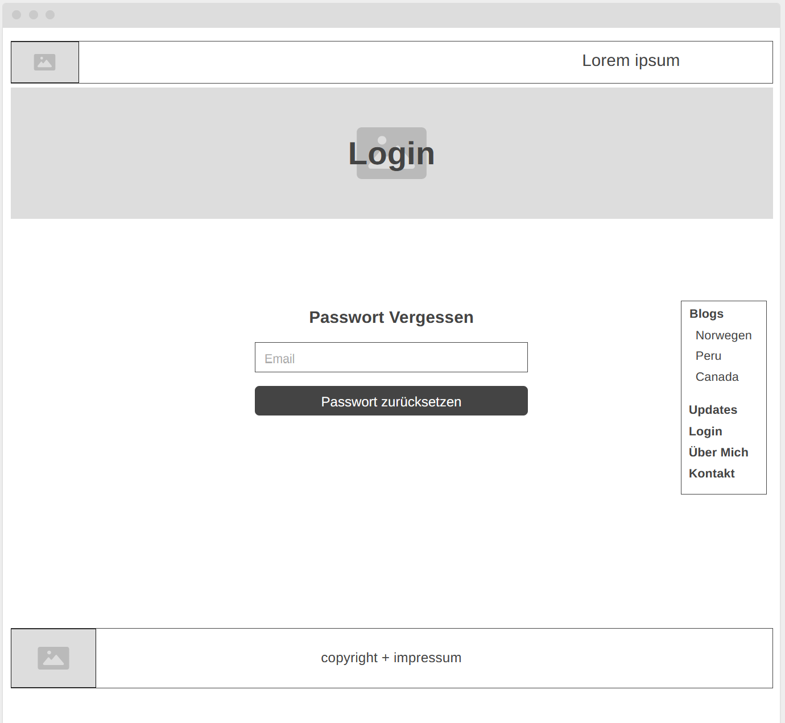

# m293_Auftrag3 Johanna Wäckerli
 Link zur publizierten Website: https://jowaeck27.github.io/m293_Auftrag3/
## Beschreibung
 In diesem Auftrag für das Modul M293, habe ich eine Website für einen fiktiven Reise-Blog erstellt. Dieser besteht aus folgenden Pages: 

    index.html - Startseite mit einer kurzen Einführung zum Blog 

    uebersicht.html - Übersicht der vorhandenen Blogposts mit Titel, kurzem Teaser und Link zum vollständigen Artikel

    canada.html - Blogpost über eine Reise nach Kanada mit Bildern und Text

    peru.html - Blogpost über eine Reise nach Peru mit Bildern und Text

    norwgen.html - Blogpost über eine Reise nach Norwegen mit Bildern und Text

    info.html - Über Mich Seite mit Informationen über die Autorin des Blogs

    kontakt.html - Kontaktseite mit einem Formular für Besucher, um mit der Autorin in Kontakt zu treten

    contactconfirm.html - Bestätigungsseite nach dem Absenden des Kontaktformulars

    login.html - Login-Seite 

    password-forgot.html - Seite zum Zurücksetzen des Passworts

    reset.html - bestätigungsseite nach dem Zurücksetzen des Passworts

    register.html - Seite zum Erstellen eines neuen Benutzerkontos

    registerdone.html - Bestätigungsseite nach dem erfolgreichen registrieren 

    update.html - Seite ist noch nicht erstellt, ist aber für die Zukunft geplant. 

    account.html - Symbolische Seite zur veranschaulichung, dass das Login funktioniert 
    (würde mit einem echten Backend dann ein Account interface haben)
    

    

  Ich habe mich für ein simples und minimalistisches Design entschieden, um die Inhalte der Blogposts in den Vordergrund zu stellen.  Alle Bilder auf der Website stammen von Unsplash.com, das Logo wurde mit https://freelogocreator.com/ und die Farbpalette mit https://coolors.co/ erstellt.

  Ich habe zur Erstellung der Website HTML, CSS und auch etwas JavaScript verwendet. Das Design ist responsiv, damit die Website auf verschiedenen Geräten funktioniert und gut aussieht. Alle Inhalte sind fest im HTML-Code verankert und die Formulare sind funktional, jedoch ohne Backend-Verarbeitung. 

  Zur publizierung der Website habe ich GitHub Pages verwendet, da Ich die Website direkt von meinem GitHub-Repository aus hosten kann und dies für mich die beste Lösung war.

   

## Styleguide
- Font-Überschrift h1: Aclonica
     - Size - Desktop = 50px
     - Size - Mobile = 38px
- Font-Buttons: Aclonica
     - Size - Desktop = 15px
     - Size - Mobile = 15px
- Font-Text: Arial
     - Size - Desktop:
       - h2 = 20px 
       - h3 = 18.72px
       - h4 = 15px
       - p = 16px
     - Size - Mobile:
       - h2 = 38px 
       - h3 = 18.72px
       - h4 = 15px
       - p = 16px 
- Farbschema

- Logo  

- Schriftzug-Logo

## Wireframes
- Startseite

- Übersicht Blogposts

- Blogpages

- Über Mich page

- Kontakt

- Login

- PW Reset

